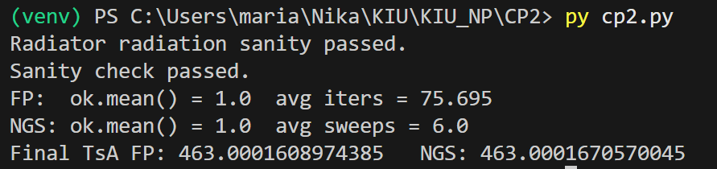
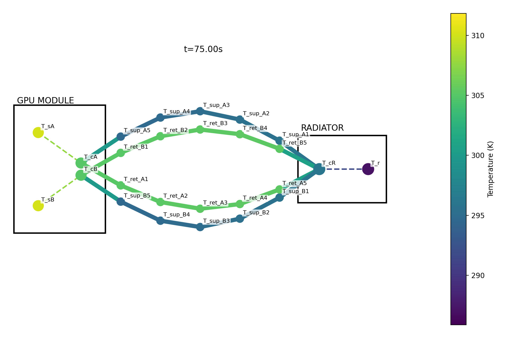
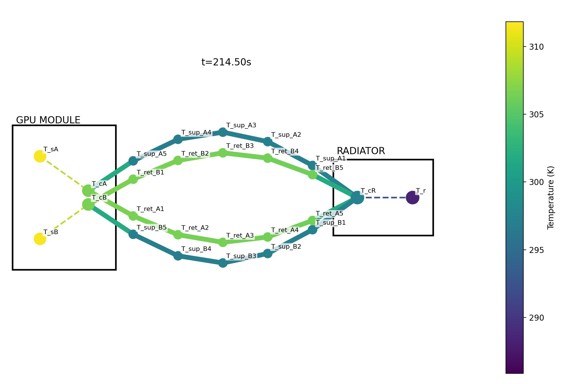
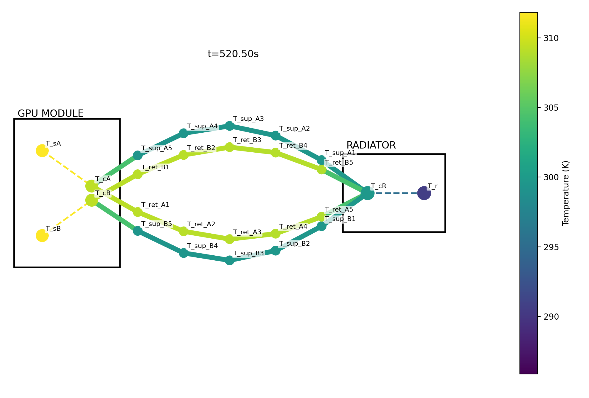
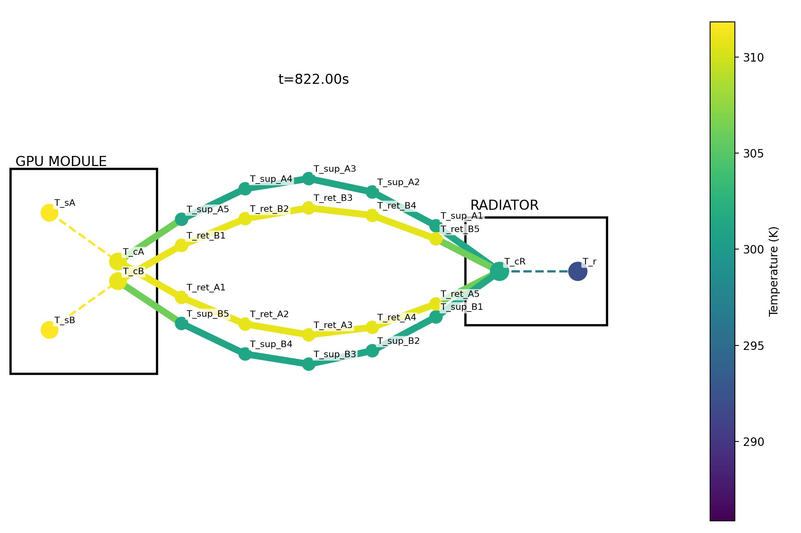

# Orbital GPU Data Center Cooling — 2-Branch ODE Model

This project demonstrates numerical solution of a system of ordinary differential equations (IVP) using implicit time-stepping.  
We compare two nonlinear solvers inside the same implicit scheme:

- Implicit Euler + Fixed-Point Iteration
- Implicit Euler + Newton–Gauss–Seidel

The physical model is intentionally lumped and simplified. The goal is to show numerical-programming skill with ODEs, not detailed aerospace design.

## Problem Setup

We model a simplified cooling loop for an orbital GPU module operating under continuous power.

- GPUs consume electrical power → heat
- A pumped coolant loop transports heat
- Radiators reject heat to space by thermal radiation
- The loop splits into two parallel branches and later merges

This creates a coupled, nonlinear, stiff ODE system, suitable for implicit methods.

## State Vector

The state consists of temperatures only.

### Branch A
- `T_sA` — server solid temperature  
- `T_cA` — cold-plate coolant temperature  
- `T_sup_A1 … T_sup_A5` — supply pipe segments (radiator → server)  
- `T_ret_A1 … T_ret_A5` — return pipe segments (server → radiator)

### Branch B
- `T_sB` — server solid temperature  
- `T_cB` — cold-plate coolant temperature  
- `T_sup_B1 … T_sup_B5` — supply pipe segments  
- `T_ret_B1 … T_ret_B5` — return pipe segments  

### Radiator
- `T_cR` — radiator coolant manifold temperature  
- `T_r` — radiator panel temperature  

Full state ordering used in code:

```text
y(t) =
[
  T_sA, T_cA,
  T_sup_A1, T_sup_A2, T_sup_A3, T_sup_A4, T_sup_A5,
  T_ret_A1, T_ret_A2, T_ret_A3, T_ret_A4, T_ret_A5,
  T_sB, T_cB,
  T_sup_B1, T_sup_B2, T_sup_B3, T_sup_B4, T_sup_B5,
  T_ret_B1, T_ret_B2, T_ret_B3, T_ret_B4, T_ret_B5,
  T_cR, T_r
]
```

## Inputs and Parameters

* `P_A(t), P_B(t)` — heat loads for branches A and B (W)
* `mdot` — total mass flow rate (kg/s)
* `phi` — flow split fraction
  * `mdot_A = phi * mdot`
  * `mdot_B = (1 - phi) * mdot`
* `G_sun` — solar irradiance (W/m²)
* `sigma` — Stefan–Boltzmann constant
* `UA_*`, `C_*`, `m_*`, `c_p` — lumped thermal parameters
* `T_bg` — background space temperature

All parameters are treated as constants.

## Governing Equations (ODE Form)

### Server solids

```text
C_sA * dT_sA/dt = P_A(t) - UA_sA * (T_sA - T_cA)
C_sB * dT_sB/dt = P_B(t) - UA_sB * (T_sB - T_cB)
```

### Cold-plate coolant volumes

```text
m_cA * c_p * dT_cA/dt =
  UA_sA * (T_sA - T_cA) + mdot_A * c_p * (T_sup_A5 - T_cA)

m_cB * c_p * dT_cB/dt =
  UA_sB * (T_sB - T_cB) + mdot_B * c_p * (T_sup_B5 - T_cB)
```

### Pipe segments (transport + environment exchange)

For each branch `i ∈ {A, B}` and segment `j = 1..5`:

Supply pipes:

```text
m_p * c_p * dT_sup_ij/dt =
  mdot_i * c_p * (T_upstream - T_sup_ij) + Q_pipe(T_sup_ij)
```

Return pipes:

```text
m_p * c_p * dT_ret_ij/dt =
  mdot_i * c_p * (T_upstream - T_ret_ij) + Q_pipe(T_ret_ij)
```

Upstream is the previous segment; first segment uses the source node
(radiator or cold plate).

### Branch merge (mixing)

```text
T_mix =
  (mdot_A * T_ret_A5 + mdot_B * T_ret_B5) / (mdot_A + mdot_B)
```

### Radiator coolant manifold

```text
m_cR * c_p * dT_cR/dt =
  (mdot_A + mdot_B) * c_p * (T_mix - T_cR)
  + UA_r * (T_r - T_cR)
```

### Radiator panel (nonlinear radiation)

```text
C_r * dT_r/dt =
  UA_r * (T_cR - T_r)
  - eps_r * sigma * A_r * (T_r^4 - T_bg^4)
  + alpha_r * A_r * G_sun
```

### Pipe heat exchange with environment

```text
Q_pipe(T) =
  alpha_p * A_p * G_sun
  - eps_p * sigma * A_p * (T^4 - T_bg^4)
```

### Radiative Heat Exchange Assumptions

All surfaces exposed to space exchange heat via thermal radiation.
In this model, radiative heat exchange is explicitly included only for
components intended to reject heat to space (radiator panels and exposed
pipe segments).

GPU modules and cold plates are assumed to be internally mounted and
thermally insulated from space; their direct radiative heat loss or gain
is neglected. Their heat exchange is modeled solely via conductive and
convective transfer to the coolant.

For exposed components, absorbed solar radiation and emitted thermal
radiation are modeled as separate terms, not combined into a single
effective heat input.

## Numerical Method

We solve the IVP using Implicit Euler:

```text
y_{n+1} = y_n + dt * f(t_{n+1}, y_{n+1})
```

At each time step this requires solving:

```text
g(y) = y - y_n - dt * f(t_{n+1}, y) = 0
```

### Solvers compared

1. Fixed-Point Iteration

   ```text
   y^{k+1} = y_n + dt * f(t_{n+1}, y^k)
   ```

2. Newton–Gauss–Seidel

   * Solve `g(y) = 0` using Newton updates
   * Variables updated sequentially (Gauss–Seidel ordering)

## Outputs

* Time histories of selected temperatures
* Convergence behavior of both solvers
* Stability comparison for larger time steps
* Summary table comparing:

  * convergence rate
  * robustness
  * computational cost

## Results
In a simple straightforward run we see that Newton-Gauss-Seidel method is far more efficient, taking 6 iterations instead of 76


We can watch it change over time:








